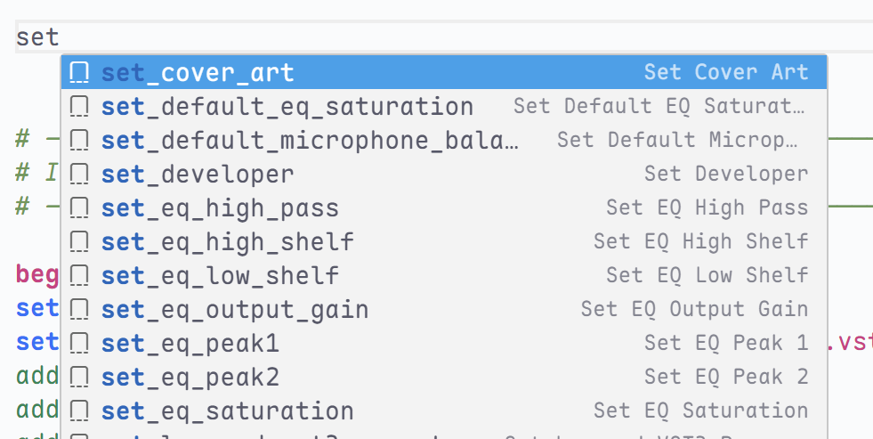
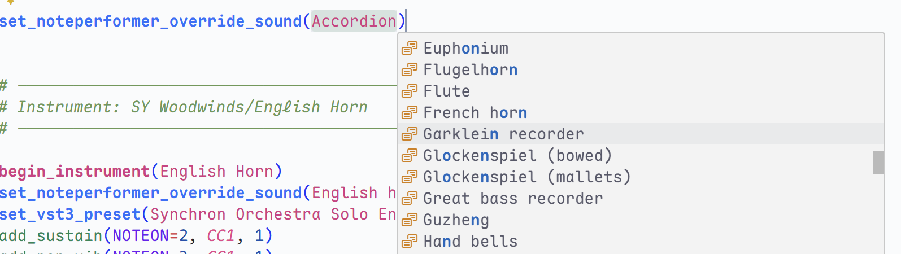

# Syntax Highlighting for NPPE Playback Engine Script

## Features

Vibrant syntax highlighting for Legacy NPPE Playback Engine Script files.

This extension includes a predefined theme, but all the color should be customizable.

## Roadmap

- [x] Basic syntax highlighting
- [x] Autocomplete
- [x] Documentations
